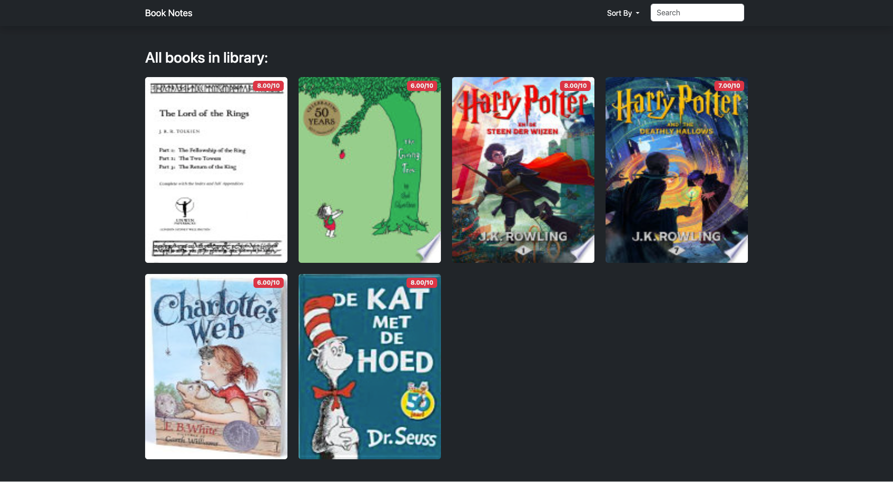

# Book Note Project

This project allows users to search for books using the Google Books API, save them with personal ratings, and add notes for future reference. The goal of this project was to practice working with APIs, databases, and server-side rendering.



## Features
- Search for books by title, author, or keywords.
- Save books with personal ratings and notes.
- Display detailed book information, including cover image, author, publication year, and description.
- Responsive design for desktop and mobile devices.

## Technologies Used
- **Node.js**: JavaScript runtime for server-side development.
- **Express.js**: Web framework for handling HTTP requests and routing.
- **PostgreSQL**: Relational database for storing book data and notes.
- **Axios**: For making HTTP requests to the Google Books API.
- **EJS (Embedded JavaScript Templates)**: For dynamic server-side rendering.
- **CSS**: For basic styling and layout.

## How to Run the Project

1. **Clone the repository:**

   ```bash
   git clone https://github.com/ammarjw/book-note.git
   cd book-note
   ```

2. **Install dependencies:**

   ```bash
   npm install
   ```

3. **Create a `.env` file** in the project root:

   ```plaintext
   DB_USER=postgres
   DB_HOST=localhost
   DB_DATABASE=book_note
   DB_PASSWORD=your_db_password
   DB_PORT=5432
   PORT=3000
   ```

4. **Run the app:**

   Using Nodemon for auto-reload on code changes:
   ```bash
   nodemon index.js
   ```
   Or simply:
   ```bash
   node index.js
   ```

   ### Quick Tip
   If Nodemon isn't installed:
   ```bash
   npm install -g nodemon
   ```

5. **Open the app:**  
   Visit `http://localhost:3000` in your browser to see the app in action.

## Notes
- Ensure PostgreSQL is running and the database `book_note` is set up correctly.
- The project focuses on functionality with minimal styling but adapts well to various screen sizes.
- Feel free to enhance the UI or add new features as needed.